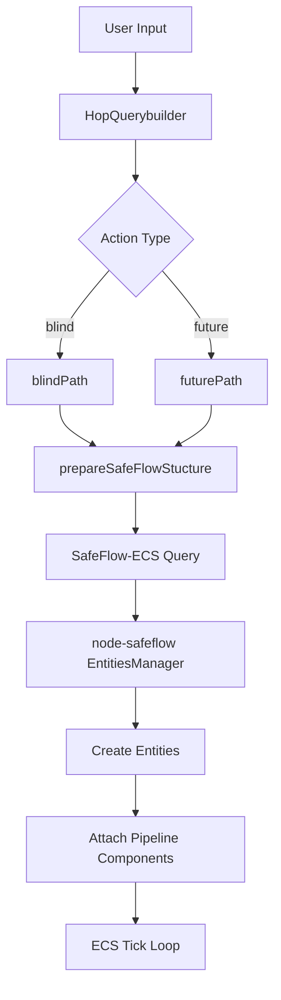

# Analysis: Updating HopQuerybuilder for ECS/Pipeline Integration

## Current State of `node-safeflow`
The `node-safeflow` repository has transitioned to an **Entity Component System (ECS)** architecture. Key changes include:
- **Pipeline Systems**: `DataFetchSystem`, `DataTidySystem`, `ComputeSystem`, and `LedgerSystem`.
- **Pipeline Components**: `DataRequestComponent`, `TidyRulesComponent`, and `ComputeContractComponent`.
- **EntitiesManager**: Now runs a `tick()` loop that updates these systems.
- **Granular Looping**: `flowMany` now processes data in 24-hour segments to generate discrete "Data Prints" for the coherence ledger.

## Required Changes in `hop-query-builder`
To support the new ECS-based `node-safeflow`, `HopQuerybuilder` needs to evolve from building static "SafeFlow" objects to building structures that can be easily mapped to ECS Entities and Components.

### 1. Update `prepareSafeFlowStucture`
The current [`prepareSafeFlowStucture`](src/index.js:510) builds a flat `modules` array. It should be updated to:
- Explicitly define the **Pipeline Components** required for each module.
- **Time Segmentation Logic**: Support the requirement that all queries are anchored to 24-hour blocks. Even if a query asks for a specific sub-segment (e.g., 30 arcs of a day), the system must first process and hash the full 24-hour day to maintain ledger coherence before parsing out the requested sub-segment.
- **Reference Contract Alignment**: Ensure that the reference contracts embedded within the module contracts (which already contain the compute hash and model) are correctly mapped to the `ComputeContractComponent` in the ECS.

### 2. Support for "Data Prints"
The query builder should include metadata that helps the `LedgerSystem` in `node-safeflow` generate the `dataPrint`. This includes:
- Clearer `device` and `datatype` definitions in the `packaging` module.
- Ensuring the `compute` module structure allows the `ComputeSystem` to easily extract the hash and model from the embedded reference contract.

### 3. New Action: `ecs-init`
Consider adding a new action type in [`queryPath`](src/index.js:29) specifically for ECS initialization. This would return a structure optimized for the `EntitiesManager` to ingest and convert into entities.

## Proposed Todo List for Implementation
1.  **Refactor `prepareSafeFlowStucture`**:
    - Update the `packaging` module to include granular device/datatype info.
    - Update the `compute` module to align with `ComputeContractComponent`.
2.  **Enhance `blindPath`**:
    - Ensure it generates the necessary metadata for the 24-hour looping logic.
3.  **Update `futurePath`**:
    - Align the predictive model update logic with the new `ComputeSystem` requirements.
4.  **Add ECS-specific metadata**:
    - Include component type hints in the generated JSON to simplify entity creation in `node-safeflow`.

## Mermaid Diagram: Updated Flow

